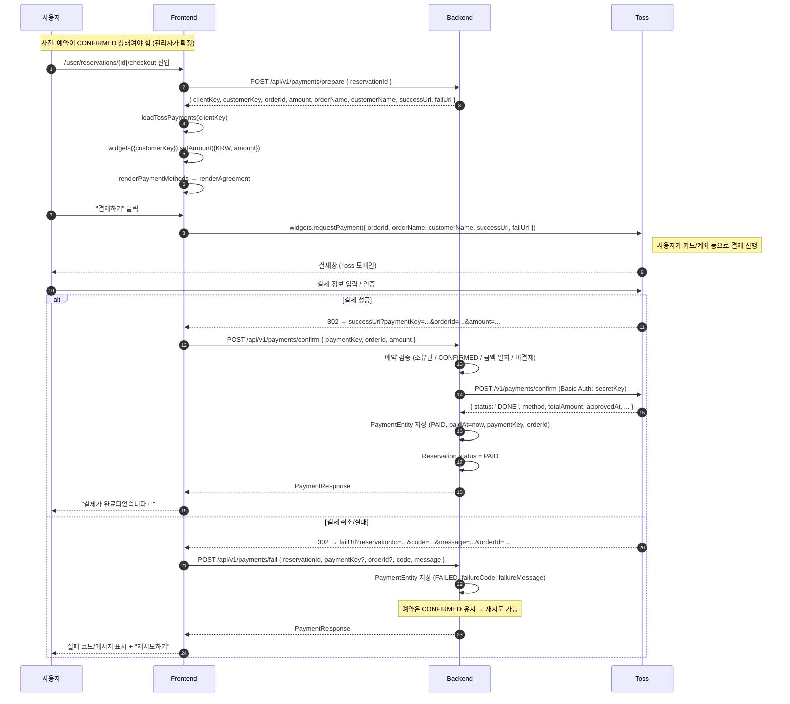

# 결제 플로우 (Toss Payments v2 위젯)

cake-order-platform 의 결제 흐름을 시퀀스 + API + 상태 머신 기준으로 정리. 코드 변경 시 이 문서도 함께 갱신.

---

## 1. 액터 / 시스템

| 액터 | 역할 |
|---|---|
| 사용자 (Browser) | 예약 생성, 위젯 결제, 결과 페이지 진입 |
| 프론트엔드 (Nuxt 4 SPA, `frontend/`) | 체크아웃·success·fail 페이지, Toss SDK 위젯 렌더 |
| 백엔드 (Spring Boot, `backend/`) | 검증, Toss confirm 호출, PaymentEntity 영속화, 예약 상태 전이 |
| Toss Payments | 결제창 / 결제 승인 / 결제 정보 보관 (외부) |
| 관리자 | 예약 확정(`CONFIRMED` 전이) — 결제 흐름 시작의 전제 조건 |

---

## 2. 시퀀스 (정상 결제)



---

## 3. 상태 머신

### `ReservationStatus` (`core/persistence/entity/ReservationStatus.kt`)

```
REQUESTED ──admin confirm──▶ CONFIRMED ──payment confirm──▶ PAID ──(픽업)──▶ COMPLETED
                                  │
                                  └── (현재 없음) CANCELLED
```

| 전이 | 트리거 |
|---|---|
| `REQUESTED → CONFIRMED` | `POST /api/v1/admin/reservations/{id}/confirm` |
| `CONFIRMED → PAID` | `PaymentService.confirmPayment` 성공 시 |
| `PAID → COMPLETED` | 미구현 (픽업 완료 액션) |
| `* → CANCELLED` | 미구현 |

### `PaymentStatus` (`core/persistence/entity/PaymentStatus.kt`)

```
PENDING  — 현재 코드 경로에서는 사용 안 함 (예약 → 결제 시도 1회 단위)
PAID     — confirmPayment 성공
FAILED   — failPayment (위젯 취소 / Toss 실패) 호출 시
REFUNDED — 환불 (미구현)
```

한 예약에 여러 PaymentEntity row 가 누적될 수 있음 — 실패 N건 + 성공 1건. `reservationId` 에 UNIQUE 없음. PAID 가 1건이라도 존재하면 이후 prepare/confirm/fail 모두 차단.

---

## 4. 백엔드 API

베이스 경로: `/api/v1/payments`. 모든 엔드포인트 JWT 필요 (`@AuthenticationPrincipal TestingUserDetails`).

| 메서드 | URL | 용도 |
|---|---|---|
| POST | `/prepare` | 결제 시작 (검증 + 위젯 메타 발급) |
| POST | `/confirm` | Toss 결제 승인 콜백 처리 |
| POST | `/fail` | 결제 취소/실패 기록 |
| GET | `/my` | 내 결제 내역 전체 |
| GET | `/by-reservation/{reservationId}` | 특정 예약의 가장 최근 결제 1건 (없으면 null) |

컨트롤러: `backend/.../service_api/reservation/presentation/PaymentController.kt`
서비스: `backend/.../service_api/reservation/application/PaymentService.kt`

### 4.1 `POST /prepare`

**요청** `PaymentPrepareRequest`
```json
{ "reservationId": 12 }
```

**검증 순서** (실패 시 즉시 throw)
1. 예약 존재? → 없으면 `1500 RESERVATION_NOT_FOUND`
2. 본인 예약? → 아니면 `1503 RESERVATION_FORBIDDEN`
3. `status == CONFIRMED`? → 아니면 `1502 INVALID_RESERVATION_STATUS`
4. PAID Payment 가 이미 있나? → 있으면 `1502` (재결제 차단). FAILED 만 있는 경우는 통과.

**응답** `PaymentPrepareResponse`
```json
{
  "clientKey":     "test_gck_docs_Ovk5rk1EwkEbP0W43n07xlzm",
  "customerKey":   "user-1",
  "orderId":       "RES-20260519-A1B2C3D4",
  "amount":        45000,
  "orderName":     "기본 케이크 외 1건",
  "customerName":  "홍길동",
  "successUrl":    "http://localhost:3000/user/reservations/checkout/success",
  "failUrl":       "http://localhost:3000/user/reservations/checkout/fail?reservationId=12"
}
```

- `customerKey` = `"user-{userId}"` (Toss 비회원 결제 호환)
- `orderId` = `reservation.reservationNumber` (Toss 규격: 6~64자, `-/_/=` 허용)
- `failUrl` 에 `reservationId` 가 미리 부착되어 있어 fail 페이지가 어느 예약 건인지 식별 가능. Toss 가 자기 쿼리(`code/message/orderId`)를 뒤에 추가로 붙임.

### 4.2 `POST /confirm`

**요청** `PaymentConfirmRequest`
```json
{ "paymentKey": "tgen_...", "orderId": "RES-20260519-A1B2C3D4", "amount": 45000 }
```

**처리 흐름** (`PaymentService.confirmPayment`, `@Transactional`)
1. orderId 로 예약 조회 → 없으면 `1500`
2. 소유권 / `status == CONFIRMED` / 금액 일치 검증
3. PAID Payment 존재 시 `1502` (중복 차단)
4. **Toss 호출** (`TossPaymentsClient.confirmPayment`)
   - `POST https://api.tosspayments.com/v1/payments/confirm`
   - `Authorization: Basic Base64(secretKey + ":")`
   - 본문: `{ paymentKey, orderId, amount }`
   - 응답 `status != "DONE"` 이면 `1601 PAYMENT_VERIFICATION_FAILED`
   - 4xx/5xx 면 응답 바디를 메시지에 담아 `1601` throw (디버깅 편의)
5. PaymentEntity 저장: `status=PAID`, `paidAt=now`, `paymentKey`, `orderId`
6. `reservation.status = PAID` (dirty checking 으로 UPDATE)
7. `PaymentResponse` 반환

`payment.mock=true` 모드: 4번을 건너뛰고 PAID 처리 (백엔드 단독 검증용).

### 4.3 `POST /fail`

**요청** `PaymentFailRequest`
```json
{
  "reservationId": 12,
  "paymentKey":    null,
  "orderId":       "RES-20260519-A1B2C3D4",
  "code":          "PAY_PROCESS_CANCELED",
  "message":       "사용자가 결제를 취소했습니다."
}
```

**처리**
1. 예약 존재/소유권 검증
2. PAID Payment 가 이미 있으면 `1502` (이미 결제 완료된 건은 실패 기록 금지)
3. PaymentEntity 저장: `status=FAILED`, `failureCode`, `failureMessage` (510자 truncate)
4. 예약 상태 변경 없음 → 사용자 재시도 가능

### 4.4 `GET /by-reservation/{reservationId}`

해당 예약의 가장 최근 PaymentEntity 1건. 없으면 `200 { data: null }`. 예약 소유권 검증.

`PaymentRepository.findFirstByReservationIdOrderByCreatedAtDesc`

---

## 5. Toss HTTP 클라이언트

`backend/.../core/client/toss/TossPaymentsClient.kt`

- HTTP: Spring `RestClient` (설정: `core/config/TossPaymentsConfig.kt`, baseUrl=`https://api.tosspayments.com`)
- 인증: `Authorization: Basic Base64("${secretKey}:")` — 시크릿 키 뒤 콜론 필수
- 멱등성: 같은 paymentKey 로 confirm 재호출 시 Toss 가 동일 응답을 돌려줌. 별도 Idempotency-Key 헤더 미사용 (필요 시 추가 가능).
- 에러: `RestClientResponseException` 캐치 → 응답 바디까지 `AppException` 메시지에 포함 → 프론트 success 페이지에서 화면에 노출

---

## 6. 프론트엔드

### 6.1 페이지

| 경로 | 파일 | 역할 |
|---|---|---|
| `/user/reservations` | `app/pages/user/reservations/index.vue` | 예약 목록. `CONFIRMED` 에 "결제하기" 버튼 |
| `/user/reservations/[id]/checkout` | `app/pages/user/reservations/[id]/checkout.vue` | prepare → SDK 위젯 렌더 → requestPayment |
| `/user/reservations/checkout/success` | `app/pages/user/reservations/checkout/success.vue` | Toss success 리다이렉트 → confirm 호출 |
| `/user/reservations/checkout/fail` | `app/pages/user/reservations/checkout/fail.vue` | Toss fail 리다이렉트 → 화면 표시 + fail 기록 호출 |

### 6.2 API 클라이언트 (`app/api/payment.api.ts`)

```ts
preparePayment(reservationId): Promise<PaymentPrepareResponse>
confirmPayment({ paymentKey, orderId, amount }): Promise<Payment>
failPayment({ reservationId, paymentKey?, orderId?, code, message }): Promise<Payment>
getMyPayments(): Promise<Payment[]>
getPaymentByReservation(reservationId): Promise<Payment | null>
```

### 6.3 SDK 사용 (체크아웃 페이지)

```ts
const tossPayments = await loadTossPayments(prepare.clientKey);
const widgets = tossPayments.widgets({ customerKey: prepare.customerKey });
await widgets.setAmount({ currency: "KRW", value: prepare.amount });
await widgets.renderPaymentMethods({ selector: "#payment-method", variantKey: "DEFAULT" });
await widgets.renderAgreement({ selector: "#agreement" }); // variantKey 미지정 → 기본값

// 결제 버튼 클릭 시
await widgets.requestPayment({
  orderId: prepare.orderId,
  orderName: prepare.orderName,
  customerName: prepare.customerName,
  successUrl: prepare.successUrl,
  failUrl: prepare.failUrl, // ?reservationId=... 이 이미 붙어 있음
});
// Redirect 방식 — 이후 라인은 정상 흐름에서 실행 안 됨
```

주의:
- 순차 `await` (Promise.all 금지 — SDK 내부 상태 경쟁)
- 위젯 초기화는 `onMounted` 안에서 1회 (Vue 라 React strict mode 같은 effect 2번 실행 이슈 없음)
- catch 시 `e.code/e.name/e.message` 를 화면에 노출 (디버깅용)

---

## 7. 설정 / 환경 변수

`backend/src/main/resources/application-local.yaml`

```yaml
toss:
  client-key: ${TOSS_CLIENT_KEY:test_gck_docs_Ovk5rk1EwkEbP0W43n07xlzm}
  secret-key: ${TOSS_SECRET_KEY:test_gsk_docs_OaPz8L5KdmQXkzRz3y47BMw6}

payment:
  success-url: ${PAYMENT_SUCCESS_URL:http://localhost:3000/user/reservations/checkout/success}
  fail-url:    ${PAYMENT_FAIL_URL:http://localhost:3000/user/reservations/checkout/fail}
  # mock=true 면 백엔드가 Toss confirm 호출을 스킵하고 즉시 PAID 처리. 흐름 시뮬레이션용.
```

| 키 | 의미 | 기본값 |
|---|---|---|
| `toss.client-key` | 프론트 SDK 초기화 키 (prepare 응답에 포함) | `test_gck_docs_*` |
| `toss.secret-key` | 백엔드가 `/v1/payments/confirm` 호출 시 Basic Auth | `test_gsk_docs_*` |
| `payment.success-url` | Toss 성공 리다이렉트 대상 | `localhost:3000/.../success` |
| `payment.fail-url` | Toss 실패 리다이렉트 대상 (백엔드가 `?reservationId=` 부착) | `localhost:3000/.../fail` |
| `payment.mock` | true 면 Toss 호출 스킵 | `false` |

### 🚨 테스트 키 페어링 주의

**`client-key` 와 `secret-key` 는 반드시 같은 머천트(=같은 prefix 그룹) 여야 함.** Toss 가 발급한 공개 테스트 키 두 세트:

| 그룹 | client-key | secret-key | 용도 |
|---|---|---|---|
| **v2 위젯 (현재)** | `test_gck_docs_Ovk5rk1EwkEbP0W43n07xlzm` | `test_gsk_docs_OaPz8L5KdmQXkzRz3y47BMw6` | `@tosspayments/tosspayments-sdk` v2 |
| v1 위젯 (legacy) | `test_ck_docs_Ovk5rk1EwkEbP0W43n07xlzm` | `test_sk_zXLkKEypNArWmo50nX3lmeaxYG5R` | v1 위젯 / 일반 결제창 |

다른 그룹끼리 섞으면 widget 이 발급한 paymentKey 를 confirm API 가 거부 (`UNAUTHORIZED_KEY`).

---

## 8. 에러 코드 (`core/exception/ErrorCode.kt`, 1600–1699)

| 코드 | 이름 | 의미 |
|---|---|---|
| 1500 | RESERVATION_NOT_FOUND | 예약 없음 |
| 1502 | INVALID_RESERVATION_STATUS | CONFIRMED 가 아님 / 이미 결제됨 등 |
| 1503 | RESERVATION_FORBIDDEN | 본인 예약 아님 |
| 1600 | PAYMENT_NOT_FOUND | 결제 없음 |
| 1601 | PAYMENT_VERIFICATION_FAILED | Toss confirm 실패 / status≠DONE / 응답 비어있음 |
| 1602 | PAYMENT_AMOUNT_MISMATCH | 요청 amount ≠ 예약 totalPrice |

Toss API 가 4xx 를 반환하면 응답 바디(`{code, message}`)가 1601 의 `AppException.message` 에 그대로 실려서 프론트 success 페이지가 화면에 출력.

---

## 9. 멱등성 / 재시도 / 동시성

- **Toss confirm 멱등**: 같은 paymentKey 로 재호출하면 Toss 가 같은 응답.
- **백엔드 중복 차단**: PAID PaymentEntity 가 1건이라도 존재하면 prepare/confirm/fail 모두 `1502` 로 거절.
- **재시도 허용**: FAILED 만 있는 경우 prepare/confirm 둘 다 통과 → 사용자가 결제를 다시 시도할 수 있음.
- **동시 confirm 호출**: 현재 비관락/낙관락 없음. DB 레벨 unique 제약은 `paymentKey` 에만 있어 더블 PAID 는 unique 위반으로 막힘. 같은 paymentKey 로 동시 confirm 들어오는 케이스는 Toss 측 멱등성 + DB unique 로 사실상 1건만 성공.

---

## 10. 알려진 한계 / TODO

- **웹훅 미구현**: 가상계좌 입금 등 비동기 상태 변경은 반영 안 됨. 카드 결제는 즉시 승인이라 영향 없음.
- **취소/환불 미구현**: Toss `POST /v1/payments/{paymentKey}/cancel` 미연동.
- **`PAID → COMPLETED` / `CANCELLED` 전이 미구현**.
- **`confirmPayment` 가 트랜잭션 안에서 외부 호출**: 응답이 느리면 DB 커넥션 점유 시간 증가. 현재는 정합성 우선. 트래픽 증가 시 timeout 설정 + 트랜잭션 분리 검토.
- **관리자 결제 조회 API 없음**: `admin_api` 쪽에 결제 검색/취소 엔드포인트 미구현.

---

## 11. 검증 시나리오 (E2E)

1. 카카오 로그인 → `/user/reservations`
2. (관리자) H2 console 또는 admin 페이지에서 예약을 CONFIRMED 로 전환
3. "결제하기" 클릭 → checkout 페이지에서 위젯 렌더 확인
4. 테스트 카드 결제 (Toss 테스트 카드 아무거나) → success 페이지 → "결제 완료" 메시지
5. `SELECT * FROM PAYMENTS WHERE reservation_id = ?` → status=PAID, paymentKey/paidAt 채워짐
6. `SELECT status FROM RESERVATIONS WHERE id = ?` → PAID
7. 실패 경로: 결제창에서 취소 → fail 페이지 진입 → status=FAILED row 가 추가됨
8. 같은 예약 재결제 → 위 1~6 다시 통과, FAILED + PAID 가 공존
9. PAID 인 예약에 다시 결제 시도 → 400 + `1502 이미 결제된 예약입니다`
